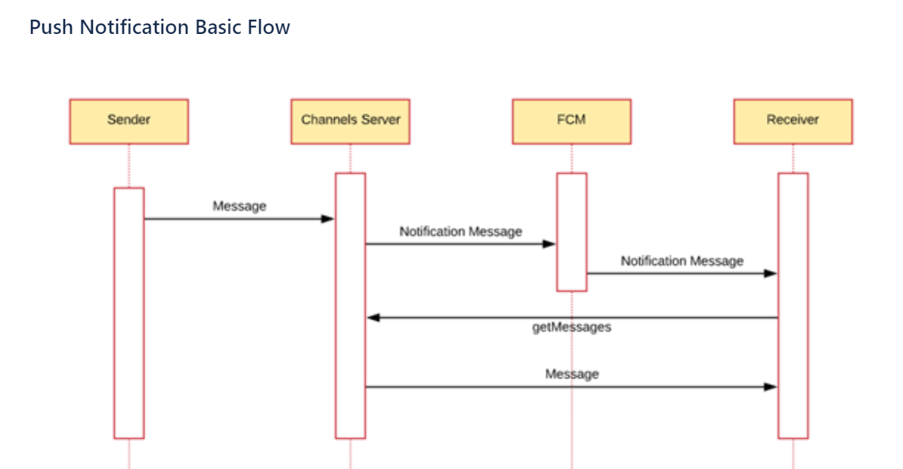
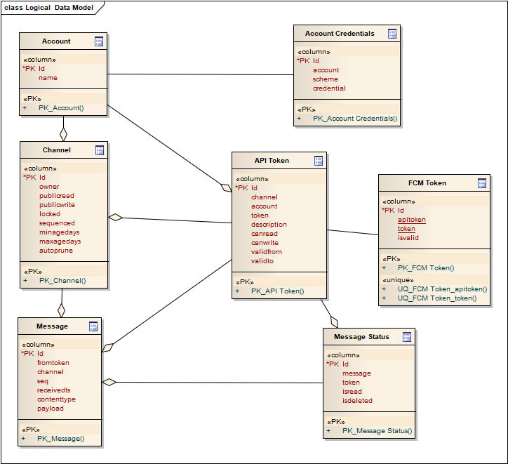

## RFC Notice

This draft spec is released as an RFC (request for comment) as part of the public review process. Any comments, criticisms or suggestions should be directed toward the [issues page](https://github.com/bitcoin-sv-specs/brfc-spvchannels/issues) on this github repository.

# SPV Channels API Specification

|     BRFC     |    title     | authors | version    |
| :----------: | :----------: | :-----: | :-----:    |
| bafaa3fa5d5b | spv_channels | nChain  | 1.1.0      |

## Overview

SPV Channels provides a mechanism via which counterparties (e.g. miners and client applications) can communicate in a secure manner even in circumstances where one of the parties is temporarily offline.

Channels are configured to transport messages. Individual Channels have owners, and owners may configure Channel read/write permissions for unauthenticated connections and distinct read/write permissions for those to whom they issue revocable message API keys.

The security model is establised by prescribing an application-level end-to-end encryption protocol, which protects transported messages.

A reference implementation of SPV Channels is shipped as a docker image and is available at [SPV Channels CE](https://github.com/bitcoin-sv/spvchannels-reference).

In summary, channels specification is a set of light weight JSON-over-HTTP public APIs for account holders and their counterparties, to exchange messages in a secure manner.

## Account Registration

A service identifies its customers/users via accounts. Message streams, whether one-shot or long-lived streams, are logically arranged into Channels, which in turn are owned by a single account. An account holder identifies ithemselves to the platform via account credentials. An account holder may generate message API tokens which may be passed to third parties (message exchange counterparts), should the platform operator or Channel owner require authentication for use of its message API.

## Channels API

The Channels API, secured by account credentials, allows account holders to create and manage Channels. The following endpoints are provided:

1. [Create Channel](#1-Create-Channel)  
2. [List Channels](#2-List-Channels)  
3. [Delete Channel](#3-Delete-Channel)  
4. [Get Channel Info](#4-Get-Channel-Info)  
5. [Get Message API Token](#5-Get-Message-API-Token)  
6. [Get Message API Tokens](#6-Get-Message-API-Tokens)  
7. [Amend Channel](#7-Amend-Channel)  
8. [Generate Message API Token](#8-Generate-Message-API-Token)  
9. [Revoke Message API Token](#9-Revoke-Message-API-Token)  

## Messages API

The Messages API allows account holders, third parties, or even the general public to read from, or write to, or request notification from Channels. Message API Tokens (obtained above) are required to use the following endpoints:

10. [Write Message to Channel](#10-Write-message-to-channel)
11. [Get Messages from Channel](#11-Get-messages-from-channel)
12. [Mark Channel Message as *read* or *unread*](#12-Mark-channel-messages-as-read-or-unread)
13. [Delete Message from Channel](#13-Delete-message-from-channel)
14. [Get Max Message Sequence from Channel](#14-Get-Max-Message-Sequence-from-Channel)
15. [Push Notifications](#15-Push-Notifications)

## Implementation

### 1. Create Channel

#### Creates a new channel owned by the account holder.

```
POST /api/v1/account/{accountid}/channel
```

#### Response

```json
{
  "id": "string",
  "href": "string",
  "public_read": true,
  "public_write": true,
  "sequenced": true,
  "locked": true,
  "head": 0,
  "retention": {
    "min_age_days": 0,
    "max_age_days": 0,
    "auto_prune": true
  },
  "access_tokens": [
    {
      "id": "string",
      "token": "string",
      "description": "string",
      "can_read": true,
      "can_write": true
    }
  ]
}
```

### 2. List Channels

#### Returns a list of all channels.

```
GET /api/v1/account/{accountid}/channel/list
```

#### Response

```json
{
  "channels": [
    {
      "id": "string",
      "href": "string",
      "public_read": true,
      "public_write": true,
      "sequenced": true,
      "locked": true,
      "head": 0,
      "retention": {
        "min_age_days": 0,
        "max_age_days": 0,
        "auto_prune": true
      },
      "access_tokens": [
        {
          "id": "string",
          "token": "string",
          "description": "string",
          "can_read": true,
          "can_write": true
        }
      ]
    }
  ]
}
```

### 3. Delete Channel

#### Deletes a single channel.

```
DELETE /api/v1/account/{accountid}/channel/{channelid}
```

#### Response

```
204 No Content
```

### 4. Get Channel Info

#### Returns information about a single channel.

```
GET /api/v1/account/{accountid}/channel/{channelid}
```

#### Response

```json
{
  "id": "string",
  "href": "string",
  "public_read": true,
  "public_write": true,
  "sequenced": true,
  "locked": true,
  "head": 0,
  "retention": {
    "min_age_days": 0,
    "max_age_days": 0,
    "auto_prune": true
  },
  "access_tokens": [
    {
      "id": "string",
      "token": "string",
      "description": "string",
      "can_read": true,
      "can_write": true
    }
  ]
}
```

### 5. Get Message API Token

##### Returns information about a single Message API Token for the channel.

```
GET /api/v1/account/{accountid}/channel/{channelid}/api-token/{tokenid}
```

#### Response

```json
{
  "id": "string",
  "token": "string",
  "description": "string",
  "can_read": true,
  "can_write": true
}
```

### 6. Get Message API Tokens

##### Returns a list of the Message API Tokens for the channel.

```
GET /api/v1/account/{accountid}/channel/{channelid}/api-token
```

#### Response

```json
[
  {
    "id": "string",
    "token": "string",
    "description": "string",
    "can_read": true,
    "can_write": true
  }
[

```

### 7. Amend Channel

##### Updates channel metadata and permissions (read/write and locking a channel).

```
POST /api/v1/account/{accountid}/channel/{channelid}
```
```json
{
  "public_read": true,
  "public_write": true,
  "locked": true
}
```

#### Response

```
200 OK
```

### 8. Generate Message API Token

##### Generate a new Message API Token for the channel.

```
POST /api/v1/account/{accountid}/channel/{channelid}/api-token
```
```json
{
  "description": "string",
  "can_read": true,
  "can_write": true
}
```

#### Response

```json
{
  "id": "string",
  "token": "string",
  "description": "string",
  "can_read": true,
  "can_write": true
}
```

### 9. Revoke Message API Token

##### Revoke Message API Token for the channel.

```
DELETE /api/v1/account/{accountid}/channel/{channelid}/api-token/{tokenid}
```

#### Response

```
204 No Content

```

### 10. Write Message to Channel

##### Write a new message to channel, requires a Message API bearer Token.

```
POST /api/v1/channel/{channelid}
```

#### Response

```json
{
    "sequence": 0,
    "received": "string",
    "content_type": "string",
    "payload": "string"
}
```

### 11. Get Messages from Channel

##### Get a list of messages from channel, requires a Message API bearer Token. 
##### By default only unread messages are returned.

```
GET /api/v1/channel/{channelid}?unread=true
```

#### Response

```json
[
  {
    "sequence": 0,
    "received": "string",
    "content_type": "string",
    "payload": "string"
  }
]
```

### 12. Mark Channel Messages as read/unread

##### Mark one or more messages in the channel, requires a Message API bearer Token.

```
POST /api/v1/channel/{channelid}/{sequence}?older=true
```
```json
{
  "read": true | false
}
```

#### Response

```
200 OK
```

### 13. Delete Message from Channel

##### Delete the specified message from the channel, requires a Message API bearer Token.

```
DELETE /api/v1/channel/{channelid}/{sequence}
```

#### Response

```
204 No Content
```

### 14. Get Max Message Sequence from Channel

##### Provide Max Sequence from the channel, requires a Message API bearer Token.

```
HEAD /api/v1/channel/{channelid}
```

#### Response

```
200 OK
```

### 15. Push Notifications


##### Subscribe to push notifications using web sockets, requires a Message API bearer Token.

```
GET /api/v1/channel/{channelid}/notify
```

Once the client receives the notification, they should pull all unread messages from the Channel. 

**Notes**:

-	Notifications are generated automatically on the server side.
-	Notifications are sent for each message written to the channel (these will be batched together in a future release).
-	The Notification message is configurable in the server configuration file.


### 16. Mobile SDK - Push Notifications to mobile

The mobile SDK supports push notifications to iOS and Android devices.



Components Description:

1. Sender (client applications and back end systems) trigger push notifications

2. To receive push notifications, user will integrate the SPV channels mobile SDK into their app

3. The user device receives a shared token from the Firebase Cloud Messaging (FCM) component. The token is sent to the SPV Channel server

4. The user device makes the push token available to the user’s app which sends the push notification token to channel server for storage

5. The channel server creates the push message and includes the push token that maps to the relevant device. FCM uses the token to determine whether to send the message to the Apple Notification Service or an Android Notification Service

6. The notification service (APNS) performs the actual delivery of messages to the user’s device. APNS receives the message from FCM containing the original APNS token that was issued on registration of the device

#### Push Notification Message Structure

SPV Channels for mobile notifications adopts the FCM Notification Message structure. 

Sample Notification Message

```json
{
  "to": "APA91bHun4MxP5egoKMwt2KZFBaFUH-1RYqx...",
  "notification": {
    "body": "2021-04-20T10:27:46.0792886Z",
    "title": "New message arrived",
  },
  "data": {
    "channelId": "w9TwhtkSvdPV0RUeO5fxbdSCvOX58AaSvu8D2YVWlKGhvHV_7ActuNAZkMLdCxd8_yaHcB_ieKankYGnPxe6zQ",
  }
} 
```

#### Register mobile device on channels server

This endpoint registers a device to receive notifications for the Message API Token that you authenticated with. 

Note: Token in request body is the FCM token.

##### Request

```
POST /api/v1/pushnotifications
```

Authorization: Message API Token

```json

{
  "token": "string"
}
```

#### Updating FCM token on channels server

The FCM token issued could change over time in the Firebase Cloud Messaging service. In the event of a token change the channels server needs to be notified. 

##### Request

```
PUT /api/v1/pushnotifications/{oldToken}
```

```json
{
  "token": "string"
}
```

#### Unsubscribe from mobile push notifications

```
DELETE /api/v1/pushnotifications/{oldToken} 
```

or with optional parameter channelId

```
DELETE /api/v1/pushnotifications/{oldToken}?channelId={channelId} 
```
This optional parameter is useful if FCM token is registered with multiple channels and user would like to unsubscribe only one of them.

#### User Interaction

Combination of FCM, SDK for mobile, and the user’s App will control the user interaction. On receipt of notification Get Messages API is used to retrieve the message payload. Due the limitations on message size (4KB) the user is most likely expected to retrieve actual payloads on other systems, with the mobile acting only as the medium to alert the user of the existence of messages on a channel.

### Client side encryption

For SPV Channels release 1.1.0, the supported encryption method is libsodium sealed_box which is an anonymous (you can not identify the sender) Public key encryption with integrity check (see here for more details: https://libsodium.gitbook.io/doc/public-key_cryptography/sealed_boxes )

Client side encryption will need to implement the algorithm:

```
libsodium sealed_box <base64 encoded encryption key>
```

## Channels Server Schema


