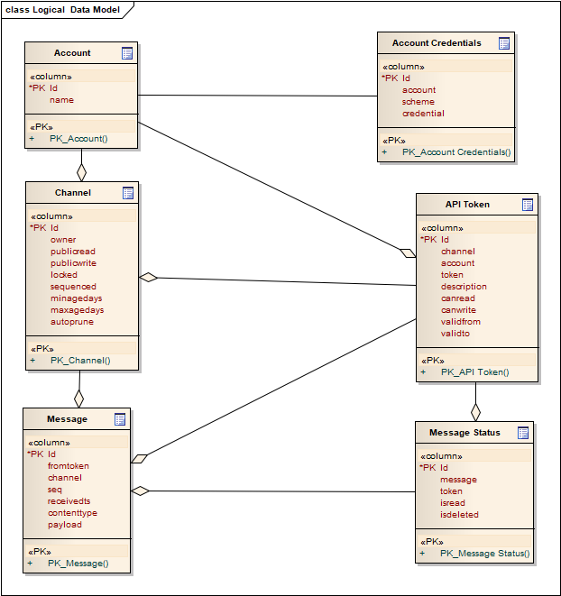

## RFC Notice

This draft spec is released as an RFC (request for comment) as part of the public review process. Any comments, criticisms or suggestions should be directed toward the [issues page](https://github.com/bitcoin-sv-specs/brfc-spvxxxxx/issues) on this github repository.

# SPV Channels API Specification

|     BRFC     |    title     | authors | version    |
| :----------: | :----------: | :-----: | :-----:    |
| d534abdf761f | spv_channels | nChain  | 0.1.0-beta |

## Overview

SPV Channels provides a mechanism via which counterparties (e.g. miners and client applications) can communicate in a secure manner even in instances where one of the parties is temporarily offline.

Channels are configured to receive messages. Individual Channels have owners, and owners may configure Channel read/write permissions for unauthenticated connections and distinct read/write permissions for those to whom they issue revocable API keys.

The security model is establised by prescribing an application-level end-to-end encryption protocol, which protects transported messages.

A reference implementation of SPV Channels is shipped as a docker image and is available [SPV Channels CE](https://bitbucket.org/nchteamnch/spv-channels/src/develop/).

In summary channels specification is set of light weight JSON-over-HTTP public APIs for account holders, and their counterparties, to exchange messages in a secure manner.

## Account Registration

A service identifies its customers/users via accounts. Message streams, whether one-shot or long-lived streams, are logically arranged into Channels, which in turn are owned by a single account. An account holder identifies itself to the platform via the account credentials. An account holder may generate API tokens which may be passed to third parties (message exchange counterparts), should the platform operator or Channel owner require authentication for its APIs.

## Channel APIs

The Channel APIs, secured by account credentials, allow account holders to create and manage Channels. The following APIs are provided:

                •	Create Channel
                •	List Channels
                •	Delete Channel
                •	Get Channel Info
                •	Get Token
                •	Get Channel Tokens
                •	Amend Channel
                •	Generate Channel API Token
                •	Revoke Channel API Token


## Message APIs

Messaging APIs allow account holders, third parties, or even the general public to read from, or write to Channels

                •	Write message to channel
                •	Get message in channel
                •	Mark message as *read* or *unread*
                •	Get all *unread* messages in all channels
                •	Delete message in channel


## Implementation

**1. Create Channel**

```
Creates a new channel owned by the account holder.

POST /api/v1/account/{accountid}/channel
```

```
**Response**
{
  "id": "string",
  "href": "string",
  "public_read": true,
  "public_write": true,
  "sequenced": true,
  "locked": true,
  "head": 0,
  "retention": {
    "min_age_days": 0,
    "max_age_days": 0,
    "auto_prune": true
  },
  "access_tokens": [
    {
      "id": "string",
      "token": "string",
      "description": "string",
      "can_read": true,
      "can_write": true
    }
  ]
}
```

**2. List Channels**

```
Returns a list of all channels

GET /api/v1/account/{accountid}/channel/list
```
```
**Response**
{
  "channels": [
    {
      "id": "string",
      "href": "string",
      "public_read": true,
      "public_write": true,
      "sequenced": true,
      "locked": true,
      "head": 0,
      "retention": {
        "min_age_days": 0,
        "max_age_days": 0,
        "auto_prune": true
      },
      "access_tokens": [
        {
          "id": "string",
          "token": "string",
          "description": "string",
          "can_read": true,
          "can_write": true
        }
      ]
    }
  ]
}
```

**3. Delete Channel**

```
Deletes a single channel

DELETE /api/v1/account/{accountid}/channel/{channelid}
```
```
**Response**
200 OK
```

**4. Get Channel Info**

```
Returns single channel information

GET /api/v1/account/{accountid}/channel/{channelid}
```
```
**Response**
{
  "id": "string",
  "href": "string",
  "public_read": true,
  "public_write": true,
  "sequenced": true,
  "locked": true,
  "head": 0,
  "retention": {
    "min_age_days": 0,
    "max_age_days": 0,
    "auto_prune": true
  },
  "access_tokens": [
    {
      "id": "string",
      "token": "string",
      "description": "string",
      "can_read": true,
      "can_write": true
    }
  ]
}
```
**5. Get Token**

```
Returns single token information

GET /api/v1/account/{accountid}/channel/{channelid}/api-token/{tokenid}
```
```
**Response**
{
  "id": "string",
  "token": "string",
  "description": "string",
  "can_read": true,
  "can_write": true
}
```
**6. Get Channel Tokens**

```
Returns list of channel tokens. Optional filter on token value.

GET /api/v1/account/{accountid}/channel/{channelid}/api-token
```
```
**Response**
{
  "id": "string",
  "token": "string",
  "description": "string",
  "can_read": true,
  "can_write": true
}
```
**7. Amend Channel**

```
Updates Channel metadata and permissions (read/write and locking a channel)

POST /api/v1/account/{accountid}/channel/{channelid}

body:
{
  "public_read": true,
  "public_write": true,
  "locked": true
}
```
```
**Response**
200 OK
```

**8. Generate Channel API Token**

```
Generate new token for channel

POST /api/v1/account/{accountid}/channel/{channelid}/api-token

body:
{
  "description": "string",
  "can_read": true,
  "can_write": true
}
```
```
**Response**
{
  "id": "string",
  "token": "string",
  "description": "string",
  "can_read": true,
  "can_write": true
}
```
**9. Revoke Channel API Token**

```
Revoke token for channel

DELETE /api/v1/account/{accountid}/channel/{channelid}/api-token/{tokenid}

```
```
**Response**
200 OK
```

**10. Write message to channel**

```
Write new message to channel

POST /api/v1/channel/{channelid}

```
```
**Response**
{
    "sequence": int,
    "received": string,
    "content_type": string,
    "payload": string
}
```

**11. Get messages in channel**

```
Get list of messages from channel. By default only unread messages are returned.

GET /api/v1/channel/{channelid}?unread=true

```
```
**Response**
[
  {
    "sequence": 0,
    "received": "2020-09-10T11:38:52.072Z",
    "content_type": "string",
    "payload": "string"
  }
]
```

**12. Mark messages as read/unread**

```
Mark message

POST /api/v1/channel/{channelid}/{sequence}

body:

{"read": true | false}
```
```
**Response**
200 OK
```

**13. Delete message in channel**

```
Delete message

DELETE /api/v1/channel/{channelid}/{sequence}

```
```
**Response**
200 OK
```

**14. Get Max message sequence in channel**

```
Max Sequence

HEAD /api/v1/channel/{channelid}

```
```
**Response**
200 OK
```

**15. Push Notifications**

```
Subscribe to push notifications using web sockets.

GET /api/v1/channel/{channelid}/notify

Once the client receives the notification it is up to them to pull all unread messages/notifications from the Channel. 

Notes:

•	Notifications are generated automatically on the server side.
•	Notification is sent for each message written to the channel, will be batched up in next release.
•	Notification message is configurable in server configuration file.

```
**Client side encryption**

For SPV Channels release 0.1.0-beta, the encryption method supported is libsodium sealed_box which is an anonymous (you can not identify the sender) Public key encryption with integrity check (see here for more details: https://libsodium.gitbook.io/doc/public-key_cryptography/sealed_boxes )

Client side encryption will need to implement the algorithm :

```
libsodium sealed_box <base64 encoded encryption key>
```

**Channels Schema**


